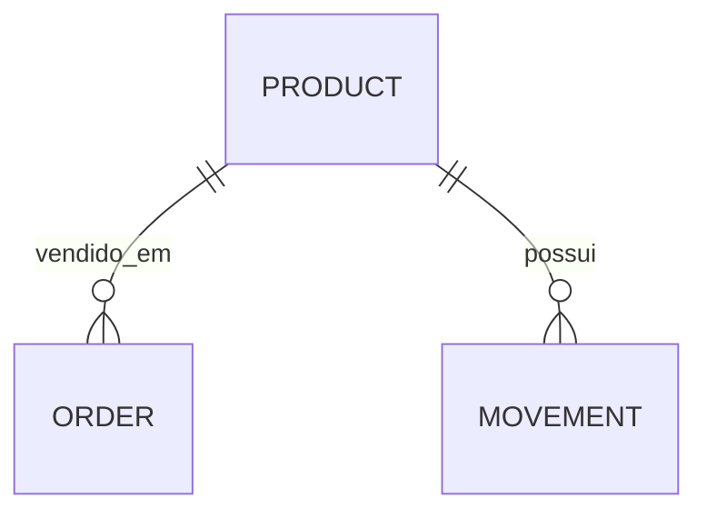

# Estoque e pedidos · ASP.NET Core

[](https://github.com/fbottega-dev/estoque-pedidos-dotnet/actions/workflows/ci.yml)

Sistema de inventário com cadastro de produtos, entradas, pedidos e histórico de movimentações. A regra central é impedir estoque negativo, inclusive quando dois compradores disputam a última unidade.

**Stack:** C# · .NET 10 · ASP.NET Core · Entity Framework Core · PostgreSQL · xUnit · Docker.


## Funcionalidades

- Produtos com SKU único, fornecedor, preço e estoque mínimo.
- Entrada de mercadoria com motivo e registro de movimentação.
- Pedido de um produto por vez; preço histórico registrado na venda.
- Atualização condicional do saldo, pedido e movimentação na mesma transação.
- Repetição segura de pedidos com o header Idempotency-Key; o mesmo envio não baixa o estoque duas vezes.
- Filtro de reposição, paginação de produtos, últimos 50 pedidos e 100 movimentos.
- API protegida por chave de operador e limite global de 120 chamadas/minuto.

## Executar com PostgreSQL

Requisito: Docker com Compose.

```bash
cp .env.example .env
# Edite DB_PASSWORD e API_KEY (mínimo de 16 caracteres).
docker compose up --build -d
```

No PowerShell, `Copy-Item .env.example .env`. Abra **http://localhost:8082** e informe a API_KEY configurada. As migrations são aplicadas ao iniciar e o banco permanece em volume.

## Executar sem Docker — demonstração SQLite

Requisito: SDK .NET 10. No PowerShell:

```powershell
$env:API_KEY="minha-chave-local-com-16-caracteres"
$env:DatabaseProvider="Sqlite"
$env:ConnectionStrings__Stock="Data Source=stock.db"
dotnet run --project src/Estoque.Api --no-launch-profile --urls http://localhost:8082
```

No Bash:

```bash
API_KEY=minha-chave-local-com-16-caracteres DatabaseProvider=Sqlite ConnectionStrings__Stock='Data Source=stock.db' dotnet run --project src/Estoque.Api --no-launch-profile --urls http://localhost:8082
```

SQLite é uma alternativa para demonstração e testes. O schema desse modo é criado por EnsureCreated; as migrations versionadas destinam-se ao PostgreSQL. Para alterar o schema demo, use um banco novo ou implemente a migração de seus dados.

## Testar

```bash
dotnet test
```

11 testes cobrem autenticação, validação, saldo, movimentação, concorrência e pedidos repetidos em SQLite. O Actions também sobe PostgreSQL via Compose e testa a última unidade e a repetição do mesmo pedido com **requisições HTTP simultâneas**.

Para esse teste isolado, use um banco Compose vazio e Node.js 22: `API_KEY=<sua-chave> node scripts/smoke.mjs`. No PowerShell defina $env:API_KEY antes. O teste insere dados fictícios e espera banco vazio.

## API REST

Todas as rotas abaixo exigem o header `X-Api-Key`.

| Método | Rota | Corpo / filtro |
|---|---|---|
| GET | /api/products | ?low=true&page=0 |
| POST | /api/products | sku, name, supplier, minimumStock, price |
| POST | /api/products/{id}/receive | quantity, reason |
| POST | /api/orders | productId, quantity, customer |
| GET | /api/orders | últimos 50 pedidos |
| GET | /api/movements | últimas 100 movimentações |

```json
{"sku":"TEC-001","name":"Teclado","supplier":"Fornecedor exemplo","minimumStock":5,"price":149.90}
```

Entradas inválidas retornam 400; conflito ou saldo insuficiente, 409; chave inválida, 401. Produtos iniciam com saldo zero: registre uma entrada antes de vender.

### Evitar pedidos duplicados

Envie `Idempotency-Key` com um UUID novo para cada pedido. Se a conexão cair, repita o mesmo corpo e a mesma chave. O servidor retorna o pedido original (201, mesmo ID e dados), mesmo que o estoque já tenha acabado. Usar a chave com outros dados retorna 409. Uma tentativa recusada por falta de estoque não reserva a chave.

```http
POST /api/orders
X-Api-Key: <chave da instalação>
Idempotency-Key: 98bfe9be-8b3a-4e81-8bca-f5448f829ff0
Content-Type: application/json

{"productId":1,"quantity":2,"customer":"Ana"}
```

A interface envia a chave e a mantém enquanto você repete a tentativa sem alterar os campos. A chave fica na memória da página; recarregar ou sair perde essa referência. Chamadas sem esse header continuam compatíveis, mas criam um pedido novo a cada envio. As chaves salvas não expiram nesta versão e são compartilhadas pela instalação, que possui um único operador.

O PostgreSQL recebe uma migration que preserva pedidos antigos. No modo SQLite, quem já tinha `stock.db` da versão anterior deve apontar para um arquivo novo (por exemplo, `Data Source=stock-v2.db`) ou migrar o schema antes de usar a nova coluna; não apague dados reais para atualizar.

## Por que a venda é atômica?

O UPDATE contém a condição Stock >= quantidade. Se nenhuma linha mudar, a venda falha. Caso contrário, pedido e movimento são inseridos antes do commit; uma falha reverte toda a transação. O banco também possui CHECK para impedir saldo negativo.



Domain contém entidades; Services reúne regras e transações; Data contém DbContext e migrations; Program define as rotas HTTP. O schema PostgreSQL pode evoluir com dotnet-ef 10.0.8 e StockDbFactory.

## Limitações e próximas entregas

- Chave única de operador, sem contas individuais ou permissões por usuário.
- Cada pedido contém um produto; carrinho com múltiplos itens é uma próxima entrega.
- Fornecedor e cliente são campos textuais, sem cadastro separado.
- Não há cancelamento, devolução ou reservas. A proteção contra pedidos repetidos exige o header Idempotency-Key.
- Docker e servidor local destinam-se à demonstração; para acesso público, configurar HTTPS, gestão de segredos e autenticação individual.

[Uso de IA e revisão](docs/AI_USAGE.md) · [Próximas entregas](docs/ROADMAP.md)
